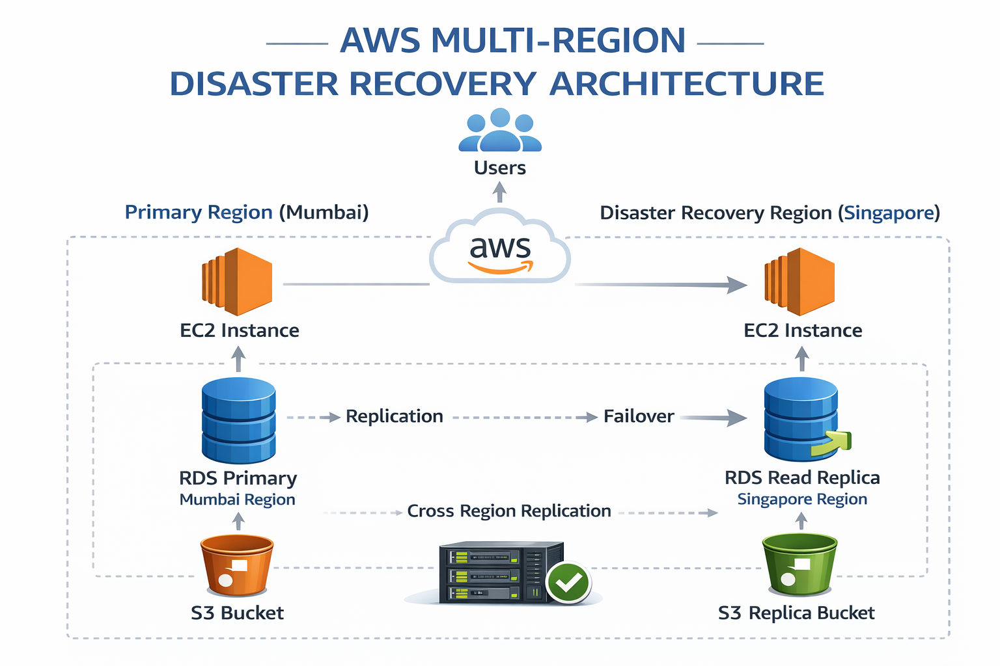
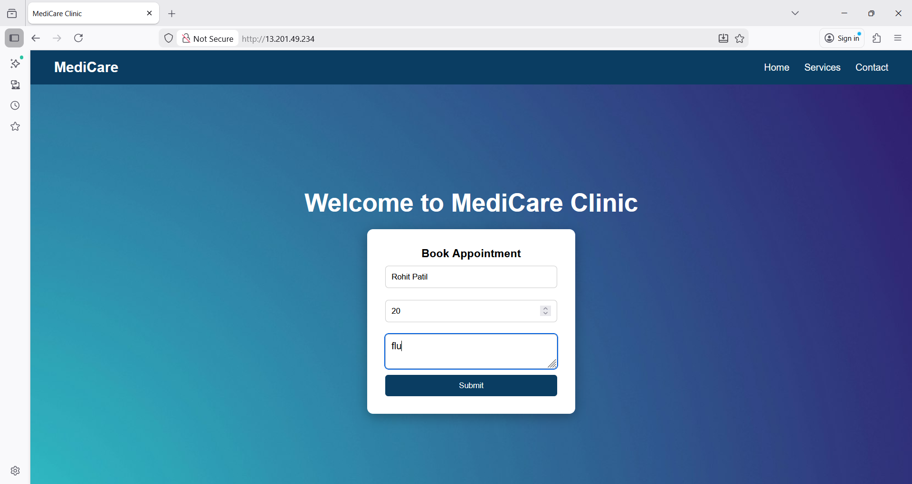
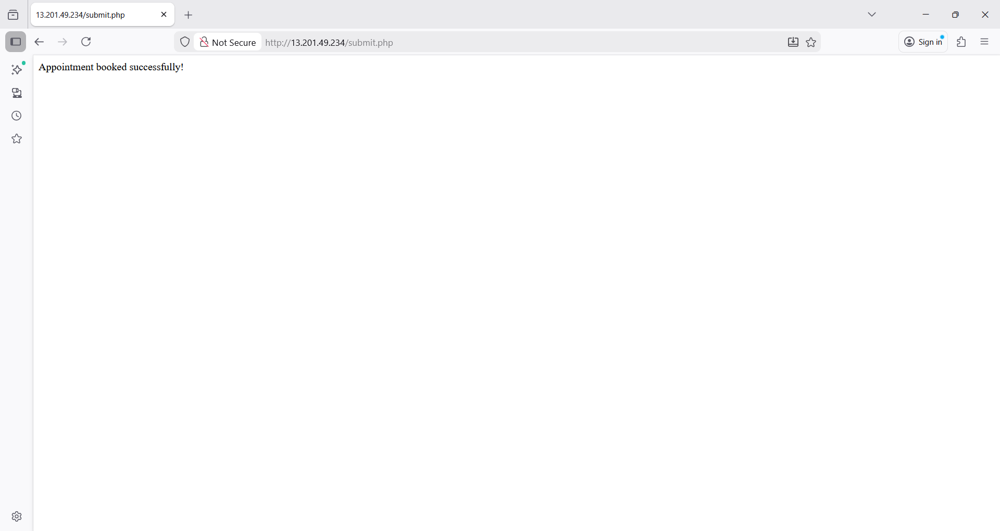

# 🌍 AWS Multi-Region Disaster Recovery Architecture

This project demonstrates the implementation of a **Multi-Region Disaster Recovery (DR) architecture** using AWS services.
The goal of this project is to ensure **high availability, data durability, and quick recovery** in case of regional failures.

The architecture uses a **primary region** for normal operations and a **secondary region** for disaster recovery.

---

# 📌 Project Overview

In modern cloud environments, failures such as region outages, infrastructure issues, or database crashes can cause downtime and data loss.
This project demonstrates how disaster recovery strategies can be implemented to maintain application availability.

The application is hosted on an EC2 instance and connected to a relational database. Data is replicated across regions to ensure that the system can recover quickly during failures.

---

# ☁ AWS Services Used

The following AWS services were used in this project:

• Amazon EC2 – Hosting the web application

• Amazon RDS – Managed relational database service

• Amazon S3 – Object storage with cross-region replication

• IAM – Identity and access management

• VPC – Network isolation and security

---

# 🏗 Architecture Design

The architecture consists of two regions:

Primary Region

* Application hosted on EC2
* Primary RDS database
* Primary S3 bucket

Disaster Recovery Region

* RDS Read Replica
* Secondary S3 bucket (replicated storage)

If the primary region fails, the disaster recovery region can take over operations.

Architecture Diagram



---

# 🖥 Application Demo

Application Home Page



Data Successfully Inserted



---

# ⚙ Environment Setup

# STEP 1 – Login to AWS Console

Login to the AWS Management Console.

Select the Primary Region for deployment.

Primary Region:

Mumbai (ap-south-1)

All main resources such as EC2, RDS and S3 are first created in this region.


________________________________________
# STEP 2 – Launch EC2 Instance (Primary Region)

Go to: EC2 → Instances → Launch Instance

Configuration:

Name: Primary-App-Server

Region: Mumbai

Instance type: t2.micro

Security Group Rules:

Port 22 – SSH

Port 80 – HTTP

Launch the instance.
________________________________________
# STEP 3 – Install Web Server on EC2
Connect to EC2 using SSH and install Nginx and PHP.
Commands:
```
sudo yum update -y
sudo yum install nginx -y
sudo yum install php php-fpm -y
sudo yum install mariadb105-server -y
```
Start and Enable service:

```
sudo systemctl start nginx
sudo systemctl enable nginx

```
Check Nginx status:
```
sudo systemctl status Nginx
```
________________________________________
# STEP 4 – Create Web Application Files

A simple web application is created to collect user data and store it in the database.

Application files:

index.html

submit.php

These files are stored in the EC2 web directory.

Command:
```
cd /usr/share/nginx/html
```
________________________________________
# STEP 5 – Create index.html File

Create the index.html file.

Command:
```
sudo nano index.html
```
________________________________________
# STEP 6 – Create submit.php File

Create submit.php file.

Command:
```
sudo nano submit.php
```

________________________________________
# STEP 7 – Create Amazon RDS Database

Go to: RDS → Create Database

Configuration: Engine: MySQL

Instance Type: db.t3.micro

Region: Mumbai

Create the database instance.
________________________________________
# STEP 8 – Connect to RDS Database

Connect to the database from EC2.

Command: ``` mysql -h <RDS-ENDPOINT>  -u  <db_username>  -p ```

Create database and table.

CREATE DATABASE medicare;

USE medicare;

CREATE TABLE appointments(
id INT PRIMARY KEY AUTO_INCREMENT,
name VARCHAR(50),
age VARCHAR(4), Problem VARCHAR(50),
);

Check data:
```
SELECT * FROM appointments;
```
________________________________________
# STEP 9 – Create RDS Read Replica

To enable disaster recovery, create a Read Replica of the primary database.

**Steps:** RDS → Select Database

Actions → Create Read Replica

Configuration: Primary Region: Mumbai

Replica Region: Singapore

Replication automatically synchronizes data from primary to replica.
________________________________________
# STEP 10 – Launch EC2 in Disaster Recovery Region

Create another EC2 instance in the DR region.

Region: Singapore

Configuration: Name: dr-database-1

Instance Type: t2.micro

This server acts as a backup application server.
________________________________________

# STEP 11 – Configure Security Group for DR Database

To allow the Disaster Recovery EC2 instance to connect to the database, the MySQL port must be allowed in the RDS security group.

**Steps:**

Go to:

EC2 → Security Groups

Select the **RDS security group** used by the Read Replica database.

Edit **Inbound Rules**.

Add the following rule:

Type: MySQL / Aurora  
Port: 3306  
Source: Security Group ID of the Secondary EC2 instance

This allows the DR application server to access the database securely.

Screenshot:


________________________________________

# STEP 12 – Create S3 Bucket

Go to: S3 → Create Bucket

Primary Bucket: Region: Mumbai

Example uploaded files:
patient-report.pdf
user-profile.jpg
dr-test-file.txt
________________________________________
# STEP 13 – Create IAM Role for Replication

Replication requires permissions.

Go to: IAM → Roles → Create Role

Trusted Entity: AWS Service

Use Case: S3

Attach Policy: AmazonS3FullAccess

Role Name: 

Purpose: The IAM role allows S3 to read data from the primary bucket and replicate it to the destination bucket.
________________________________________
# STEP 14 – Configure S3 Cross-Region Replication

Enable replication between buckets.

Primary Bucket: Mumbai

Replica Bucket: Singapore

Steps: S3  →  Primary Bucket  →  Management  →  Replication Rules  →  Create Rule

Replication Flow:

Primary Bucket (Mumbai)

↓

Automatic Replication

↓

Replica Bucket (Singapore)

Whenever a file is uploaded to the primary bucket, it is automatically copied to the replica bucket.
________________________________________
# STEP 15 – Failover Testing

Failover testing ensures that the system continues working even if the primary region fails.

**Steps:**

1.Simulate failure in the primary database

2.Promote RDS Read Replica

3.Connect application to DR database

**Failover Flow:**
Primary Database Failure

↓

Promote Read Replica

↓

Replica becomes Primary Database

↓

Application connects to DR Region
________________________________________
# STEP 16 – Architecture Flow

**Application Flow:**

User Browser

↓

EC2 Web Server (Mumbai)

↓

index.html Form

↓

submit.php

↓

RDS Primary Database

↓

RDS Read Replica (Singapore)


**S3 Data Flow:**

S3 Bucket (Mumbai)

↓

Cross-Region Replication

↓

S3 Replica Bucket (Singapore)
________________________________________
# STEP 17 – Recovery Objectives

Final RTO Calculation

RTO = Recovery Time – Failure Time

Example:
Failure time = 10:00 AM

Recovery time = 10:06 AM

RTO = 6 minutes
________________________________________

# 📁 Repository Structure

```
aws-multi-region-disaster-recovery
│
├── README.md
│
├── architecture
│   └── architecture-diagram.png
│
├── screenshots
│   ├── mysql_cli.png
│   ├── primary_app.png
│   ├── primary_data_insert.png
│   ├── primary_ec2.png
│   ├── primary_ec2_stop.png
│   ├── primary_rds.png
│   ├── primary_s3.png
│   ├── secondary_app.png
│   ├── secondary_app_newdata.png
│   ├── secondary_data_insert.png
│   ├── secondary_ec2.png
│   ├── secondary_new_datainsert.png
│   ├── secondary_rds.png
│   ├── secondary_s3.png
│
└── documentation
    └── project-report.pdf
```

---

# 🎯 Key Features

• Multi-region disaster recovery architecture

• Database replication using Amazon RDS

• Object storage replication using Amazon S3

• High availability and fault tolerance

• Failover testing

---
## 📚 Lessons Learned

During the development of this project, the following key concepts and practical skills were learned:

• Understanding the fundamentals of Disaster Recovery (DR) and High Availability in cloud environments.

• Designing a multi-region architecture to improve system reliability.

• Launching and configuring application servers using Amazon EC2.

• Creating and managing relational databases using Amazon RDS.

• Implementing cross-region database replication using RDS Read Replica.

• Promoting a Read Replica to a standalone database instance during failover testing.

• Implementing object storage replication using Amazon S3 Cross-Region Replication.

• Understanding the importance of Recovery Time Objective (RTO) and Recovery Point Objective (RPO).

• Performing basic failover testing to verify disaster recovery readiness.

• Learning how to manage AWS resources efficiently and cleaning them up after testing to avoid unnecessary costs.

---

# 📄 Documentation

Detailed project documentation is available in above pdf.

[View Project Documentation](./documentation/project-report.pdf))


---

# 👩‍💻 Author
Ankita pansare
